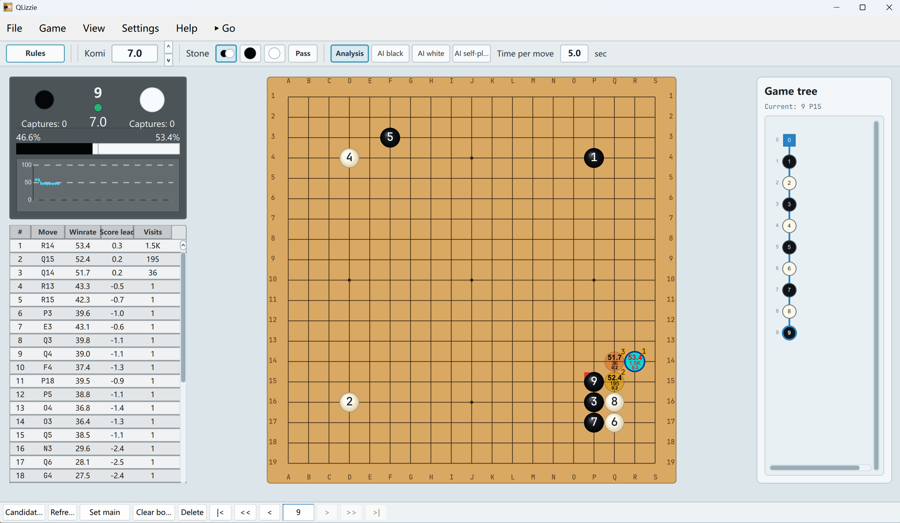
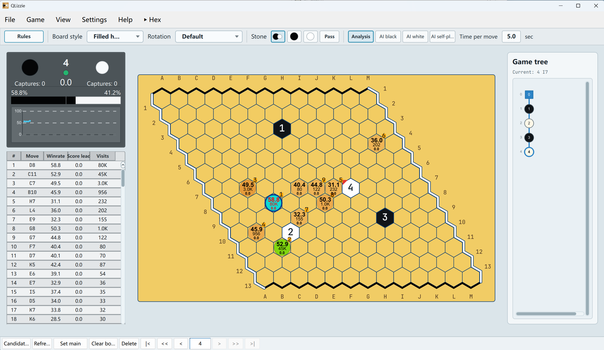

# QLizzie | [中文版](README.zh-CN.md)

QLizzie is a Qt 6 AI analysis interface for Go, Gomoku, Hex, and similar board games, mainly targeting KataGo/KataGomo-style engines, with functionality and visual style inspired by LizzieYZY.

## Screenshots

### Go Analysis



### Hex Analysis



## Overview

QLizzie is a desktop analysis board built with Qt 6. It focuses on a clean 2D board, engine candidate visualization, a Lizzie-like left analysis panel, and a game tree workflow for reviewing variations across multiple board games.

The project references LizzieYZY for feature direction and visual behavior, but it is a separate Qt 6 implementation. It was built through an iterative Codex vibe-coding workflow.

## Features

- Go, Gomoku, Hex, Connect6, Reversi, hexagonal Go variants, Ataxx, Breakthrough, and free-grid analysis modes
- Scalable 2D board with multiple coordinate formats, stones, move numbers, and candidate markers
- Hex triangle-grid and filled-hex-cell board presentations, including rotated/flipped display modes
- Win-line/path highlighting for Gomoku and Hex
- GTP engine integration, including KataGo/KataGomo-style `kata-analyze`
- Engine preset list for switching between multiple engine commands and rule defaults
- Candidate list, winrate, visits, score/draw-rate display, ranking labels, and variation preview
- Per-node analysis cache in the game tree for previously analyzed positions
- Game tree navigation, node deletion, branch handling, and SGF loading/saving
- Engine communication log
- English and Chinese UI

## Build

### Windows

Requirements:

- Qt 6
- CMake 3.24+
- A C++17-capable compiler, such as MSVC

Example build:

```powershell
cmake -S . -B build/qlizzie
cmake --build build/qlizzie --config Release
```

The executable is generated under:

```text
build/qlizzie/app/Release/qlizzie.exe
```

### macOS (Apple Silicon)

Requirements:

- macOS 12 or later
- Xcode Command Line Tools (provides Clang)
- Homebrew

Install Qt 6 and CMake:

```bash
brew install qt cmake
```

Configure and build:

```bash
cmake -S . -B build/qlizzie -DCMAKE_PREFIX_PATH=/opt/homebrew
cmake --build build/qlizzie --config Release
```

> If CMake finds Qt 6 automatically, the `-DCMAKE_PREFIX_PATH=/opt/homebrew` option can be omitted. On Intel Macs the corresponding Homebrew prefix is usually `/usr/local`.

The build produces an app bundle:

```text
build/qlizzie/app/qlizzie.app
```

Run it from Finder by double-clicking, or from the terminal:

```bash
open build/qlizzie/app/qlizzie.app
```

You can also run the executable directly:

```bash
./build/qlizzie/app/qlizzie.app/Contents/MacOS/qlizzie
```

The first time you launch QLizzie, open **Engine List** and add a GTP engine preset (for example, a KataGo binary, its config file, and a model). Settings are saved in `qlizzie.app/Contents/MacOS/settings.ini` by default.

To make a redistributable bundle that includes the Qt libraries, run:

```bash
macdeployqt build/qlizzie/app/qlizzie.app -qmldir=app/qml
```

## Engine

QLizzie communicates with GTP-compatible AI engines. Engine presets can store a name, command line, rule type, default board size, komi, and Hex coordinate compatibility settings.

For KataGo/KataGomo-style analysis, use an engine command that starts GTP mode and points to your config and model files. QLizzie is primarily developed and tested around KataGo-family `kata-analyze` output.

Example KataGo command:

```text
katago gtp -config /path/to/gtp.cfg -model /path/to/model.bin.gz
```

## Relationship To LizzieYZY

QLizzie is not LizzieYZY and is not affiliated with the LizzieYZY project. LizzieYZY is used as a reference for the expected analysis workflow, candidate display behavior, and overall interface feel.

## Friendly Links

- [LizzieYZY](https://github.com/yzyray/lizzieyzy)
- [Lizzie3D](https://github.com/hzyhhzy/Lizzie3D)

## License

QLizzie is released under the GNU General Public License v3.0. See [LICENSE](LICENSE).
