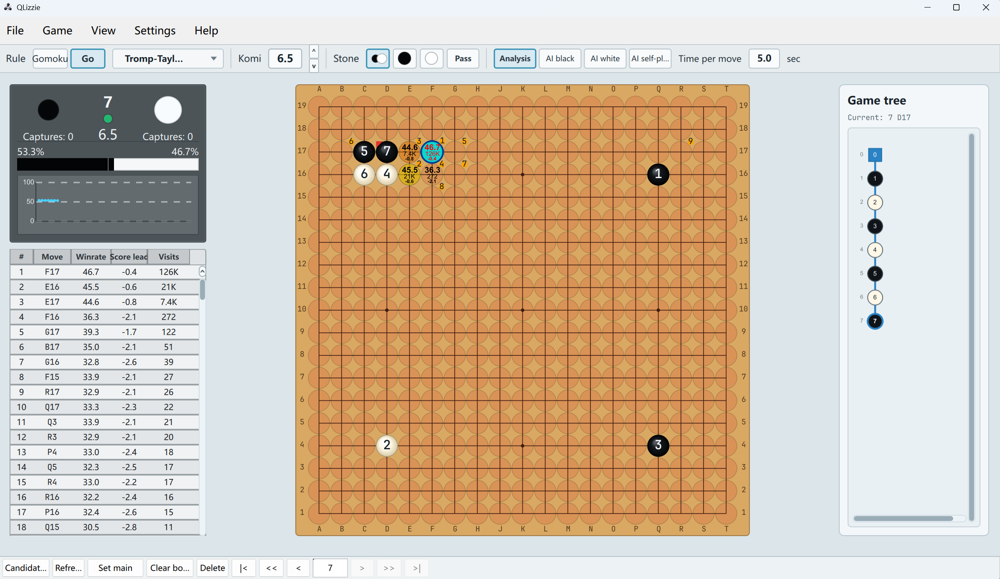

# QLizzie

QLizzie 是一个基于 Qt 6 的围棋、五子棋、Hex 棋等棋类 AI 分析界面，主要面向 KataGo/KataGomo 风格引擎，功能和样式方面参考了 LizzieYZY。



## 简介

QLizzie 是一个桌面分析棋盘程序，重点是干净的 2D 棋盘、引擎选点显示、类似 Lizzie 的左侧分析栏，以及用于复盘变化的游戏树工作流，并逐步支持多种网格棋类。

本项目在功能方向和视觉行为上参考了 LizzieYZY，但它是一个独立的 Qt 6 实现。本项目基于 Codex vibe coding 的迭代方式构建。

## 功能

- 支持围棋、五子棋和 Hex 棋分析模式
- 2D 棋盘，支持多种坐标格式、棋子、手数、选点标记缩放显示
- Hex 棋支持三角网格和六边形涂色棋盘，并支持旋转/翻转显示
- 五子棋和 Hex 棋支持胜负连线/连接路径高亮
- GTP 引擎集成，支持 KataGo/KataGomo 风格的 `kata-analyze`
- 引擎列表可保存多个引擎命令、规则、默认棋盘大小、贴目和 Hex 坐标兼容设置
- 选点列表、胜率、计算量、目差/和棋率、排名标号、变化图预览
- 棋谱树节点级分析缓存，回到分析过的局面时可以先显示缓存选点
- 游戏树导航、删除节点、分支处理、SGF 读取和保存
- 引擎通信日志
- 中英双语界面

## 构建

依赖：

- Qt 6
- CMake
- 支持 C++17 的编译器，例如 Windows 上的 MSVC

示例构建命令：

```powershell
cmake -S . -B build/qlizzie
cmake --build build/qlizzie --config Release
```

可执行文件会生成在你选择的构建目录中，例如：

```text
build/qlizzie/app/Release/qlizzie.exe
```

## 引擎

QLizzie 通过 GTP 协议和 AI 引擎通信。引擎预设可以保存名称、命令行、规则类型、默认棋盘大小、贴目和 Hex 坐标兼容设置。

如果使用 KataGo/KataGomo 风格分析，请使用能启动 GTP 模式，并指向你的配置文件和模型文件的引擎命令。QLizzie 目前主要围绕 KataGo 系 `kata-analyze` 输出开发和测试。

## 与 LizzieYZY 的关系

QLizzie 不是 LizzieYZY，也不隶属于 LizzieYZY 项目。LizzieYZY 是本项目在分析工作流、选点显示行为和整体界面感觉上的参考项目。

## 友情链接

- [LizzieYZY](https://github.com/yzyray/lizzieyzy)
- [Lizzie3D](https://github.com/hzyhhzy/Lizzie3D)

## 开源协议

QLizzie 使用 GNU General Public License v3.0 开源。详见 [LICENSE](LICENSE)。
